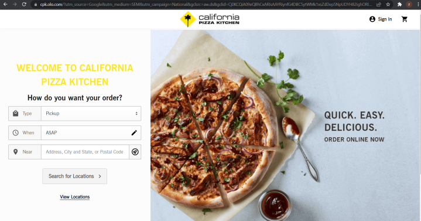
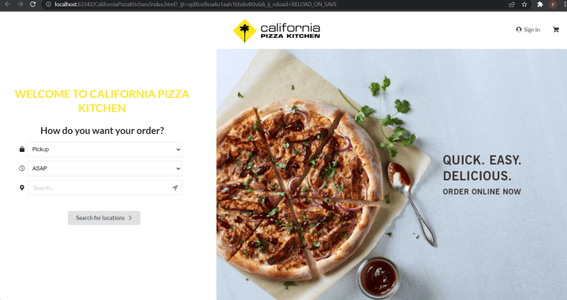

Learning UI Frameworks are a lot of work. However, the outcome was worth the effort. During the week of learning Semantic UI, it was exhausting looking for its corresponding class name. Yet, the product amazed me. It was exciting to discover that the page I'm making is starting to look like something modern we use these days. This is my first time utilizing Framework. Something like Semantic UI really helps to dedicate time and provide a professional outcome for your work. And I think with the benefits and results that Semantic UI brought to me, Frameworks are definitely worth the time and investment of my time. Moreover, I could now find any web page and duplicate something similar in a few hours. 

Although it's been only a week working with Semantic UI, we have accomplished a couple of great website pages together. It was fascinating how closely our website could be as the image shown. This is one of my choice web pages for the California pizza kitchen. While there might be a couple of things, I would have to adjust upon. For example, the input field, the logo, and maybe the font for words. It's definitely, a significant improvement in efficiency from plain HTML and CSS to such a web page in a week of duration. 

While working with Semantic UI, I did find inconvenience. It is hard to adjust the location of the image, header, and paragraphs separately. It will start to get confusing with lots of similar div class names, which will stack up for a long HTML page. It may be the reason that I've only been in touch for a short period of time. But I absolutely think these could have been improved in the Framework.
