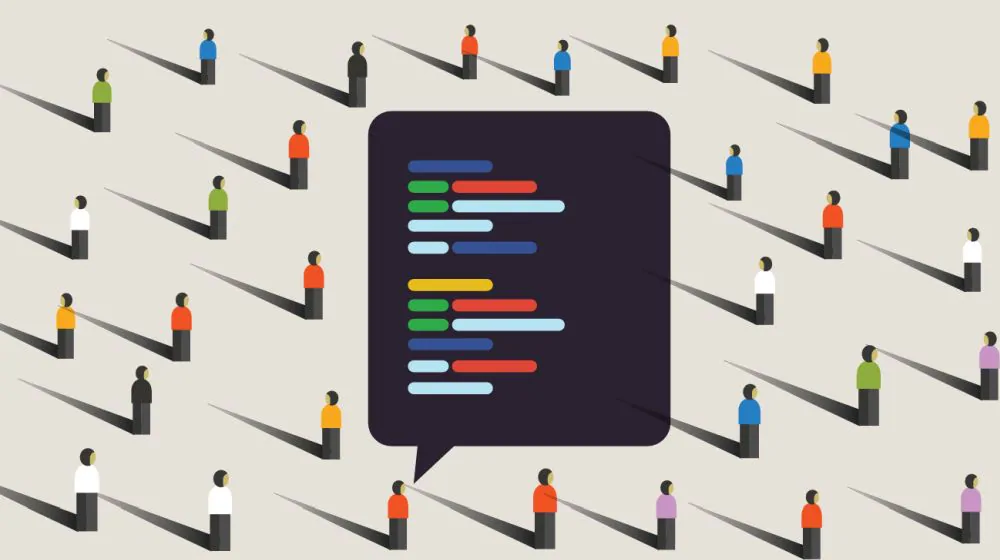

Software engineers develop, design, and test software applications. Throughout the semester course of Software engineering, web application development is a major focus skill we have obtained. However, there are many concepts within the development of the application. In Software development currently, Working through plain HTML and CSS can hardly give professional results in any designs. User Interface Frameworks help us accomplish design materials related to user interaction such as buttons and icons. In another word, User Interface Frameworks help us easily assist to create user-interaction events for effective development. Throughout the semester the User interface Framework we were utilizing are Semantic UI and React. Semantic UI provides lots of themed designs for websites while react allows developers to change data without reloading the page. These tools have tremendous benefits in the efficiency of progress.

Open Source Software Development is a concept for working in a team. Throughout the project, Our team was able to store the source code using GitHub for easy access and modifications to the project. The Project Boards assisted us with our issue management significantly, we were able to resolve issues and tasks for our project in an orderly manner. Open Source Software Development enables every to edit and modify the files given. Working with open source can be hard, however, when everyone is working in a different direction it boosts the efficiency of the developing process.

Another concept I learned would be the style of Agile Project Management, which is also called Issue Driven Project Management. I believe this would be where everything starts, all projects will start with a task. After everyone is done with a major task then they analyze and find issues with their project to keep on perfecting the application. Driven Project management will allow developers to quickly identify and solve issues with their team leaders efficiently.
